
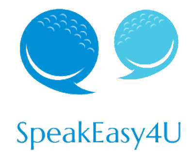

# SpeakEasy4U
__Author:__ @[danielLinke]

Software			| Specification
:-------------------|:----------
Name				| SpeakEasy4U
Version 			| 0.1 (Prototype)
Platform			| min. Android 4.4 - KitKat
Type				| Augmentative and alternative communication software (AAC)
Copyright (c)		| 2015 Daniel Linke, Platini Ujang, Telge S. Peiris (MIT license)

SpeakEasy4U is a software prototype designed for the [PERKATA special school](http://jeffsimcl.tripod.com/Perkata/index.htm) in Kuching, Malaysia. The application is an [augmentative and alternative communication](https://en.wikipedia.org/wiki/Augmentative_and_alternative_communication) software for mobile devices with Android. The objective of the software is to help special need children from the PERKATA special school in Kuching, Malaysia with the every daily live communication. The application enables children with speech impairments such as autism an communication with others via an mobile device. It is an symbol-based software solution with voice output and a simple user interface designed for kids. SpeakEasy4U has been developed within a study project at the [Swinburne University of Technology](http://www.swinburne.edu.my/) in 2015.
   
## Table of contents
1.	[Study project](#study-project-)
2.	[Setup](#setup-)
3.	[Prototype design](#prototype-design-)
4.	[Prototype implementation](#prototype-implementation-)

## Study project 

Study project		| Details
:-------------------|:----------
University			| Swinburne University of Technology (Kuching, Malaysia)
Course				| Bachelor of Computer Science
Lecture				| HIT3061 - Software Team Project (final year project)
Time period 		| Summer semester 2015 (03/2015 - 07/2015)
Supervision 		| Dr. Lau Bee Theng
Team member			| Daniel Linke, Platini Ujang, Telge S. Peiris

During a semester abroad in Kuching, Malaysia at the Swinburne University of Technology in 2015, I attended the final year project HIT3061 - Software Team Project. The objective of the final year project was to develop an augmentative and alternative communication software for the PERKATA special school in Kuching, Malaysia. The software has been developed under the supervision of Dr. Lau Bee Theng and in collaboration with the PERKATA special school. The project team contains of 3 international students of computer science. The application was developed by using the rapid prototype development method. The first version of the prototype or rather the minimal viable product (MVP) is subsequently presented in the following sections.

## Setup 
The `SpeakEasy4U-Signed.apk` can be installed on any Android device up to Android 4.4 (KitKat). Firstly, you must enabling _"Unknown sources"_ in your security settings of the mobile Android device. Afterwards you can copy and install the `SpeakEasy4U-Signed.apk` on your phone or tablet. After the installation you can start the application. The initial PIN code for the admin mode is `1234`. The code can be change in the admin settings.

## Prototype design 
The requirement specification and the rapid prototype development was executed in collaboration with the supervisior Dr. Lau Bee Theng and the PERKATA special school in Kuching. The application SpeakEasy4U should be support children with speech impairments such as autism. The software make it easier to communicate in the daily life and during school lessons. SpeakEasy4U is a free mobile application for Android devices such as smartphone and tablets. The features of the application are illustrated in the following use case diagram.

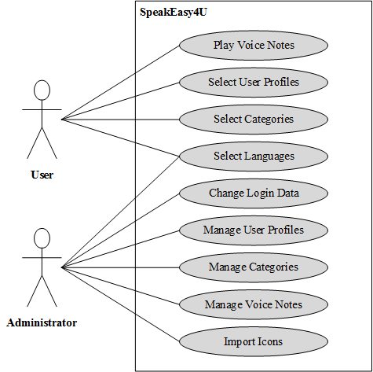

  
The Android application SpeakEasy4U was develeoped with the cross-plattform development platform [Xamarin](https://www.xamarin.com/). Xamarin is Microsoft-owned company and a make it possible to build native apps for multiple platforms on a shared C# codebase. As data management system the application used the embedded database [SQLite](https://www.sqlite.org/). Addionatally, the software used the Google Text-to-Speech API for voice outputs. The initial prototype supports the langauges English and Bahasa Malay.     

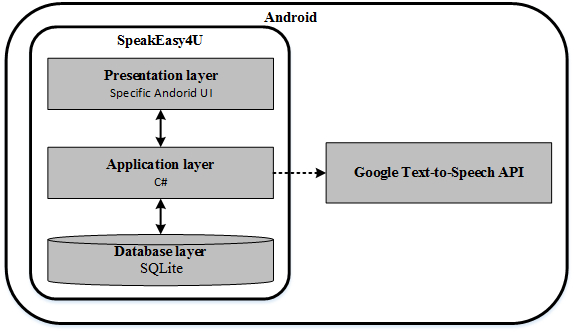

The data model of the mobile application includes the entities `Profile`, `Category` and `Voice Node`. The file `Database.cs` contains mock data for tests.  
 

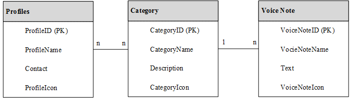

The following figure contains the user interface mock-ups form the design process. The mock-ups have emerged from the collaboration with the supervisior and the PERKATA speical school and served as the basis for the rapid prototype development process. 

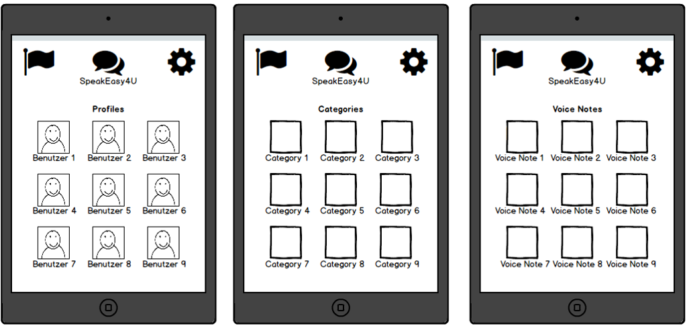

## Prototype Implementation 

### User mode

	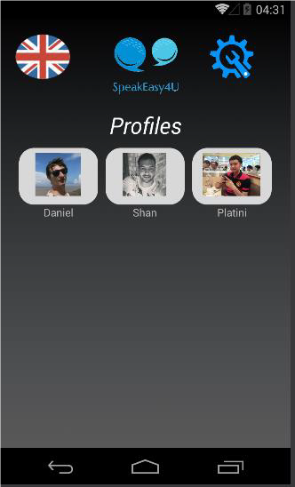
	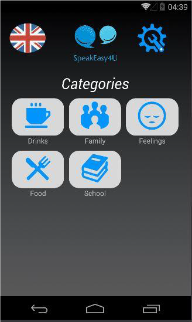
	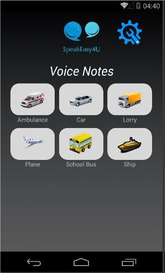

### Admin mode

	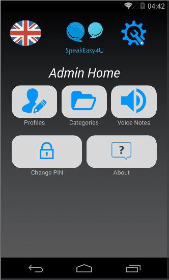
	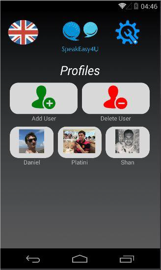
	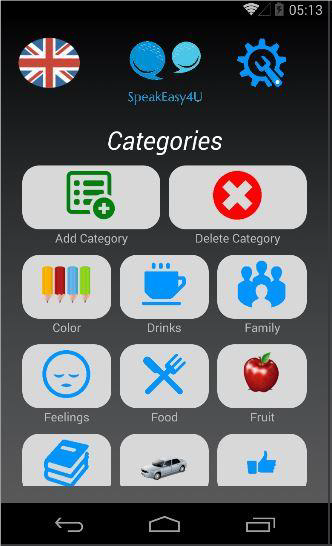
	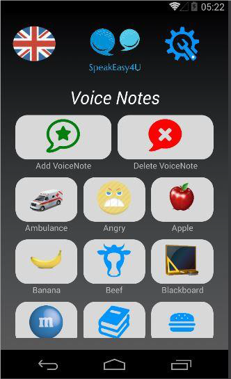
	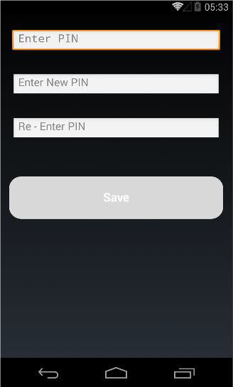
	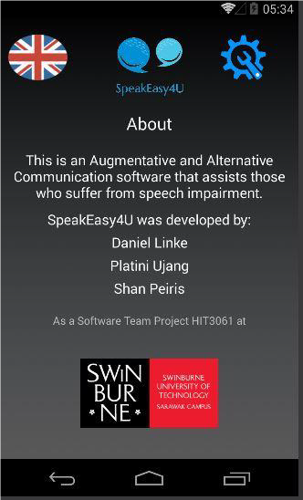

